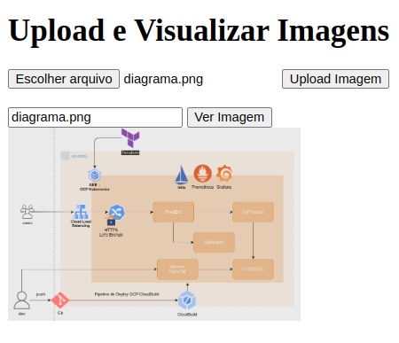

## Api de imagens - Parte do projeto devopslabs01
### 
### Laboratório de DevOps com:
- ServiceMesh
- Pipeline de CICD (GCP Cloudbuild)
- Observabilidade
- Infraestrutura como código
- Kubernetes
- Cloud GCP
- E mais abordagens relacionadas a cultura DevOps.

### Repositórios relacionados:
- [FrontEnd - devopslabs01](https://github.com/Adenilson365/devopslabs01-frontend)
- [BackEnd - Catalogo devopslabs01](https://github.com/Adenilson365/devopslabs01-serviceMesh)
- [Terraform - IAC](https://github.com/Adenilson365/devopslabs01-iac)

### Como executar:
- Necessário ter o docker instalado [LINK](https://www.docker.com/)
```
docker compose up -d --build
```
### Como parar:
```
docker compose down
```

- Api será exposta no localhost:5001/get-images/id
    - id é o nome da imagem com extensão (imagen1.png)
- Front será exposto no localhost:5000

